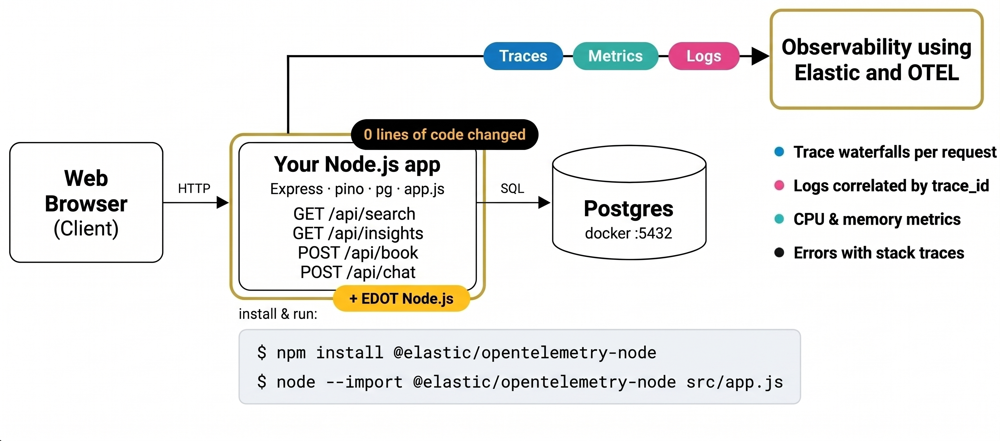

# Skyward for Business — Node.js observability demo with Elastic

[](https://codespaces.new/suyashcjoshi/elastic-observability-nodejs-demo?quickstart=1)
[](https://www.elastic.co/docs/reference/opentelemetry/edot-sdks/node)
[](https://nodejs.org)
[](LICENSE)

A Node.js flight search app with four bugs on purpose. Use Elastic Observability to find each one, fix it, and watch the app get better.

The app has no OpenTelemetry code. Elastic gets its data from one startup flag:

```sh
node --import @elastic/opentelemetry-node src/app.js
```

> **This is a learning demo.** The slow code is on purpose. Don't copy it into a real service.
>
> **Using an AI coding tool?** Point it at [AGENTS.md](AGENTS.md).

## Architecture



## The four problems

| What you see | Cause | Where to look in Elastic | Fix |
|---|---|---|---|
| Search takes over 5 seconds | `CHAOS_STAIRCASE`: partners are called one after another | Trace waterfall shows a staircase of four HTTP spans | `CHAOS_STAIRCASE=false` (calls run in parallel) |
| Chat shows "Error: unexpected server response" | Missing `await` on `pool.query()` in `/api/chat` | Errors tab shows a `TypeError` pointing at the line | Add `await` |
| App feels frozen, chat says "Still connecting..." | `CHAOS_GAP`: slow duplicate-removal blocks the event loop | `/health` takes ~700 ms with no child spans; `nodejs.eventloop.delay` spikes | `CHAOS_GAP=false` (faster Map-based version) |
| Booking fails with a request ID | `CHAOS_PARTNER`: no timeout on Penguin Air, which is slow and sometimes returns 503 | Dependencies view shows Penguin Air in red; error traces link to logs | `CHAOS_PARTNER=false` (1.5 s timeout and fallback) |

## Quick start

**You need:** Node.js 20.6+ and Docker. An Elastic Cloud project is only needed for step 2.

### 1. Run the app

```bash
git clone https://github.com/suyashcjoshi/elastic-observability-nodejs-demo
cd elastic-observability-nodejs-demo
npm install
cp .env.example .env
npm run dev          # starts Postgres, seeds it, starts partners and app
npm run verify       # prints PASS when everything works
```

Open http://localhost:3000 and click Search (LHR → SFO is pre-filled).

In a Codespace, click the badge at the top instead. The app is ready on port 3000 in about two minutes.

### 2. Connect to Elastic

1. No Elastic account? Start a free trial at [cloud.elastic.co/registration](https://cloud.elastic.co/registration) and choose **Serverless → Observability**.
2. In your project, open **Add data → Application → OpenTelemetry** and copy the endpoint and API key.
3. Add them to `.env`:
   ```
   OTEL_EXPORTER_OTLP_ENDPOINT=https://<your-project>.ingest.<region>.elastic.cloud:443
   OTEL_EXPORTER_OTLP_HEADERS=Authorization=ApiKey <your-api-key>
   ```
4. Run `npm run dev`. After a minute, `skyward-search` shows up under **Observability → Services**.

### 3. Fix one problem at a time

Change one `CHAOS_*` flag in `.env`, run `npm run dev`, search again, and compare in Kibana.

To compare side by side:

```bash
npm run start:fast         # fixed app on :3001
npm run load               # load test :3000 (slow)
npm run load:fast          # load test :3001 (fixed)
```

## Useful commands

| Command | What it does |
|---|---|
| `npm run dev` | Start everything (Postgres, partners, app) |
| `npm run verify` | Check all endpoints |
| `npm run status` | Show what is running |
| `npm run stop:all` | Stop everything |
| `npm test` | Run smoke tests |

To run with Docker instead: `docker compose up -d` (and `docker compose down` to stop).

## Learn more

- [EDOT Node.js setup](https://www.elastic.co/docs/reference/opentelemetry/edot-sdks/node/setup)
- [Quickstart: monitor application performance](https://www.elastic.co/docs/solutions/observability/get-started/quickstart-monitor-your-application-performance)
- No cloud account? Run Elastic locally: `curl -fsSL https://elastic.co/start-local | sh -s -- --edot`

## License

Apache-2.0. See [LICENSE](LICENSE).
